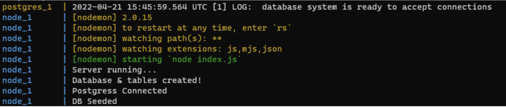

# Implement an app with React
## Introduction

In this project you will build our pocket movie app in which we will keep track of our favorite movies and set up a watch later list. You will use the ReactJs knowledge that you accumulated in previous projects to build the interface and show data from an API.

## Read or watch

* [Vite | docs](https://vite.dev/guide/)
* [React Hooks](https://legacy.reactjs.org/docs/hooks-intro.html)
* [React Font Awesome](https://docs.v5.fontawesome.com/web/use-with/react)
* [React Router](https://reactrouter.com/)
* [axios](https://github.com/axios/axios)
* [ES6](https://www.w3schools.com/js/js_es6.asp)
* [JWT Authentication](https://www.jwt.io/introduction#what-is-json-web-token)

## Learning Objectives

* Manage state and props in a react component
* Use React hooks to achieve certain behavior
* Implement a design with JSX and CSS (React)
* Implement a frontend app with React

## Requirements

* Class components are not allowed
* A README.md file, at the root of the folder of the project, is mandatory
* Try to use ES6 features

## Setting up the backend

* Installing docker
  * This [link](https://docs.docker.com/engine/install/ubuntu/) has all the steps needed for installing docker depending on your system.
* Installing docker-compose
  * Official [documentation](https://docs.docker.com/compose/install/) for installing docker-compose
* Make sure that docker is running before proceeding
* Cloning and running the backend server
  * Clone this [repository](https://github.com/hs-hq/holbertonschool-cinema-guru-API) on your local machine
  * cd into the repository folder and run the following commands:
    * docker-compose build --no-cache --force-rm
    * docker-compose up
    * After running the above command you should get an output similar to this indicating that the backend and db are running.
    

## Notes
* You'll be adding the base url before each API route mentioned in the tasks: http://localhost:8000/
* The [repository](https://github.com/hs-hq/holbertonschool-cinema-guru-API) contains detailed information about each route in the API
* The React and friends versions to use :
* "react": "^18.3.1"
* "react-dom": "^18.3.1"
* "react-router-dom": "^7.6.2"
* "react-scripts": "5.0.1"
